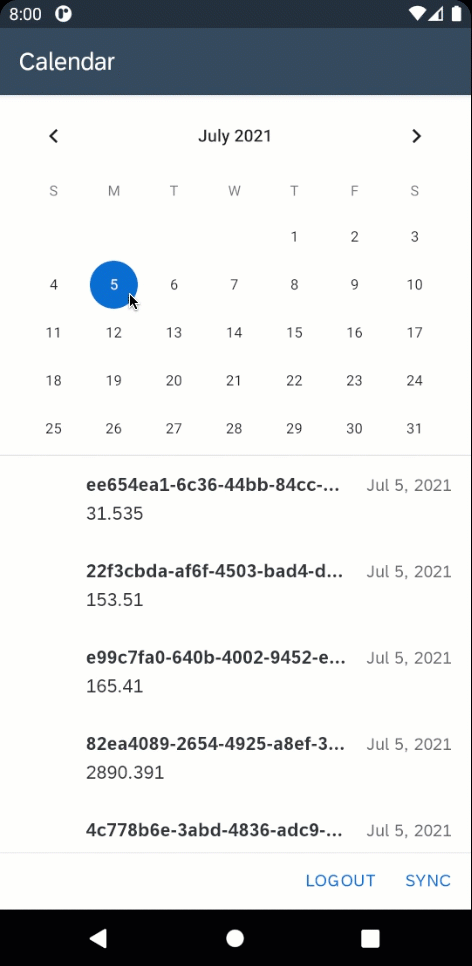

# Calendar View App

This is a showcase application that demonstrates how to implement the Calendar View for Android as Extension Control.

*Last Updated: 05-Jul-2021*

### Author
* Robin Kuck ([GitHub](https://github.com/robinkuck), [SAP Community](https://people.sap.com/kucki99))

***

## Requirements

### Supported Platforms

* Android

### MDK Client Version

* MDK 5.2 or higher

### Data Source

* Mobile Services Sample OData ESPM

***

## Key Highlights

* Filtering of Object Table by selected date using implementation of Extensions `OnValueChange` Event
* Native control used: [Android CalendarView](https://developer.android.com/reference/android/widget/CalendarView)

## To Do

* Add implementation of native [FUICalendarView](https://help.sap.com/doc/978e4f6c968c4cc5a30f9d324aa4b1d7/Latest/en-US/Documents/Frameworks/SAPFiori/Classes/FUICalendarView.html) Control for iOS

***

## Setup Instructions

No additional steps required. The content of [metadata/](metadata/) folder can be used as is to run the application.
