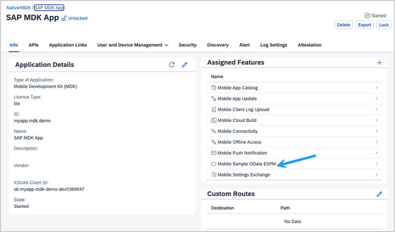
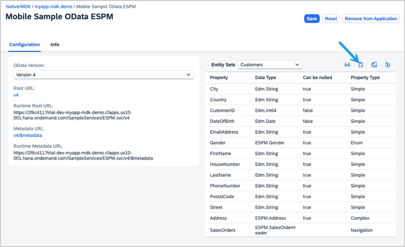
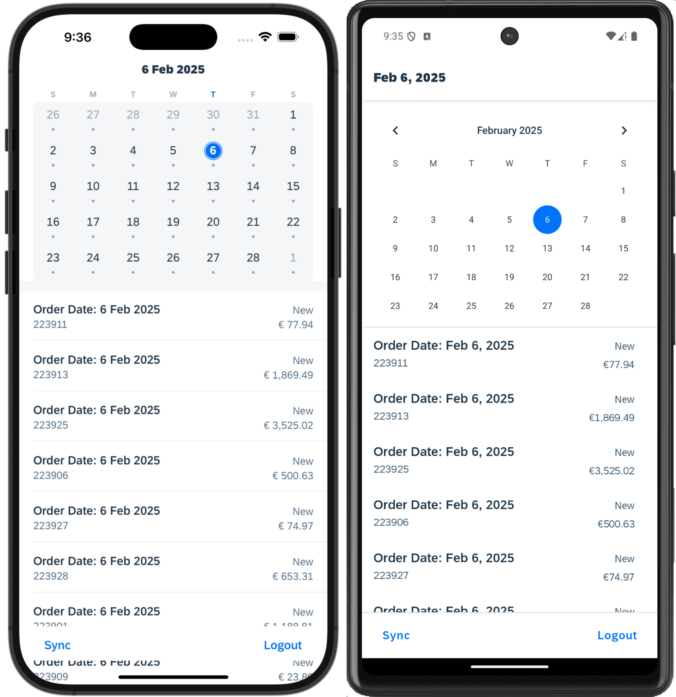
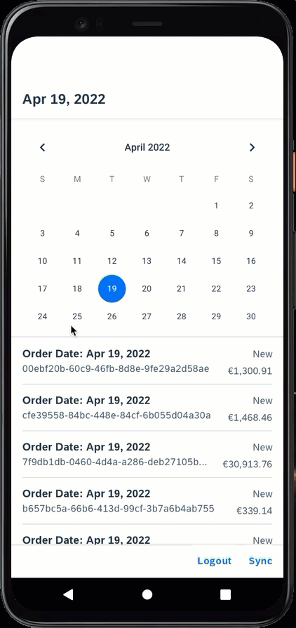

# Calendar View Extension App

This is a showcase application that demonstrates how to implement the Calendar View for Android as Extension Control.

*Last Updated: 19-Aug-2022*

### Author
* Robin Kuck ([GitHub](https://github.com/robinkuck), [SAP Community](https://people.sap.com/kucki99))

***

## Requirements

### Supported Platforms

* iOS, Android

### MDK Client Version

* MDK 6.1 or higher

### Data Source

* Mobile Services Sample OData ESPM (destination created as SampleServiceV2)

***

## Key Highlights

* Filtering of Object Table by selected date using implementation of Extensions `OnValueChange` event. This event is currently not supported in the layout editor, open the `Calendar.page` in code editor to access it. 
    >You might not see any Sales Orders in the table. Read below on how to add additional Sales Orders
* Native control used: [Android CalendarView](https://developer.android.com/reference/android/widget/CalendarView) and [iOS FUICalendarView](https://help.sap.com/doc/978e4f6c968c4cc5a30f9d324aa4b1d7/Latest/en-US/Documents/Frameworks/SAPFiori/Classes/FUICalendarView.html) from [SAP BTP SDK for iOS](https://help.sap.com/doc/f53c64b93e5140918d676b927a3cd65b/Cloud/en-US/docs-en/guides/getting-started/ios/introduction.html)

***

## Setup Instructions

The [App_Resources/iOS/src](App_Resources/iOS/src) folder contains a native [UIViewController](https://developer.apple.com/documentation/uikit/uiviewcontroller) which implements the [FUICalendarView](https://help.sap.com/doc/978e4f6c968c4cc5a30f9d324aa4b1d7/Latest/en-US/Documents/Frameworks/SAPFiori/Classes/FUICalendarView.html) control. The application metadata is the [CalendarViewExtensionApp](CalendarViewExtensionApp) folder and it is assumed that you will load and deploy the metadata to Mobile Services from an MDK Editor.

For a more detailed information on the setup for MDK development please see the following tutorial.

* [Build Your Mobile Development Kit Client Using MDK SDK](https://developers.sap.com/tutorials/cp-mobile-dev-kit-build-client.html)

Before executing the create-client command you need to copy the [App_Resources](App_Resources) folder into your .mdkproject folder. You can find more information about adding native iOS source code [here](https://docs.nativescript.org/guides/ios-source-code.html) and details about the structure of .mdkproject folder [here](https://help.sap.com/doc/f53c64b93e5140918d676b927a3cd65b/Cloud/en-US/docs-en/guides/getting-started/mdk/custom-client/branding-custom-client.html#structure-of-mdkproject).

[CalendarViewExtensionApp](CalendarViewExtensionApp) is the application metadata project that you can import into your SAP Business Application Studio workspace or SAP Web IDE Full Stack workspace. You should deploy this project to your mobile services account and make sure to enable feature `Mobile Sample OData ESPM` in your mobile services app.

### Generate additional Sales Orders for current date

You can generate Sales Orders which are displayed in the Object Table after the application started. (The date filter is executed on the `CreatedAt` attribute of SalesOrderHeaders) 

In the app configuration of SAP Mobile Services cockpit, select the `Mobile Sample OData ESPM` feature:

Select `Generate sample sales orders`:

In the mobile application, select `Sync` to synchronize offline store and download the generated Sales Orders:

## Screenshots

 
