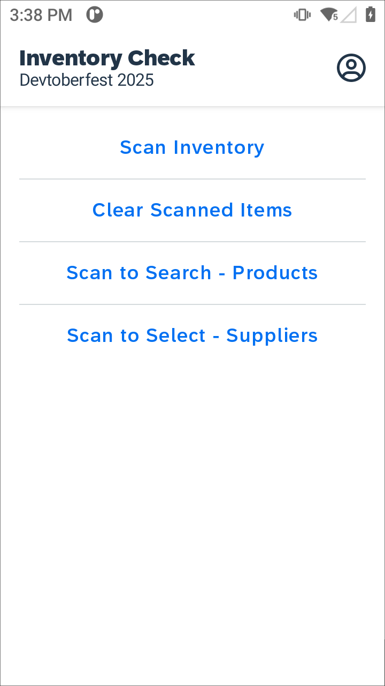

# Devtoberfest 2025 - Build Mobile Solutions with Advanced Scanning using SAP Build

This is the demo application created during the Build Mobile Solutions with Advanced Scanning using SAP Build Devtoberfest 2025 live steam session.  The session created an MDK Android application that integerated with a Zebra device with hardware laser scanner.

You can watch the Devtoberfest session on [You Tube](https://www.youtube.com/watch?v=Qy3VDqQedjM)

*Last Updated: 20-Oct-2025*

***

## Author

* Bill Froelich ([GitHub](https://github.com/billfroelich), [SAP Community](https://people.sap.com/bill.froelich))

***

## Requirements

### *Prerequisites*
Requires configuration of the intent delivery using the *Data Wedge* application on the device to configure the MDK Client as the Associated App to receive the intent along with the Intent Output Action Name.

### *Supported Platforms*

* Android

### *MDK Client Version*

* MDK 24.11 or higher

### *Data Source*

* Mobile Services Sample OData ESPM (destination created as com.sap.edm.sampleservice.v4)

***

## Key Highlights

* Registers to receive the intent broadcast from the Zebra scanning hardware via the defined action name
* Includes an Scan Inventory page to quickly populate and count scanned inventory based on the received intent
* Scanned inventory is persisted in App Client Data
* Added a Scan to Search option to the Products list page to use the received scan value as a search term
* Added a Scan to Select option on the Suppliers page to display the matching supplier detail page for a scanned Supplier ID, Name, Street or City.  If more than one match is found the value is used as a search term instead

## Templates 
In the Rules/ScannerManager/Templates folder are the following template files

| Filename | Description |
| --- | --- |
| exampleRegisterReceiver.js | Sample rule to register a receiver for a specific broadcast intent |
| exampleSendIntent.js | Example of sending a Broadcast Intent from your MDK application |
| exampleScannerManager.js | Class template including initialization, suspend, resume and helper functions that is the basis for the Zebra version included in this app | 
| exampleEventReceived.js | Sample rule to be linked to an MDK page OnCustomEventDataReceived event to process the custom scan event data | 

## Screenshots

| Functionality | Android |
| --- | --- |
| Main Page |  |
