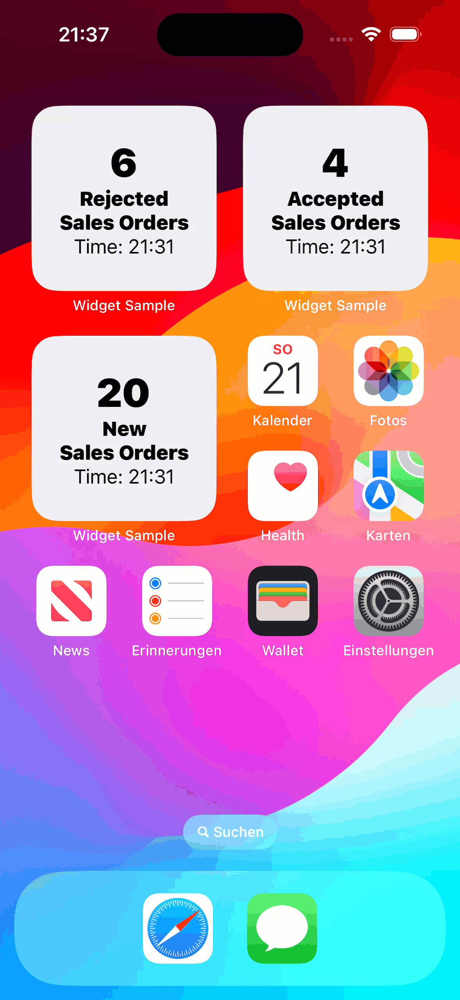
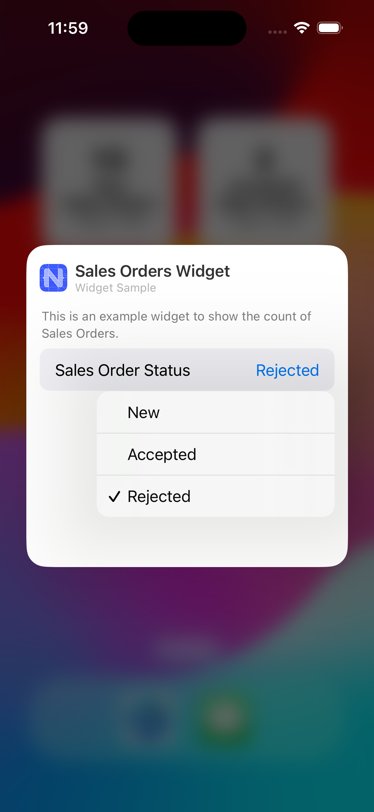

# Home Screen Widget App

This is a showcase application that demonstrates how to implement a [Home Screen Widget for iOS](https://support.apple.com/en-us/HT207122). The implementation is based on this [blog post](https://blog.nativescript.org/add-home-screen-widget/) where you can find further explanations and details about the signing of the app with widget extension for release.

*Android Widget sample will be added soon.*

*Last Updated: 11-Mar-2024*

### Author
* Robin Kuck ([GitHub](https://github.com/robinkuck), [SAP Community](https://community.sap.com/t5/user/viewprofilepage/user-id/16438))

***

## Requirements

### Supported Platforms

* iOS 17.0 or higher

### MDK Client Version

* MDK 23.12 or higher

### Data Source

* Mobile Services Sample OData ESPM (destination created as com.sap.edm.sampleservice.v2)

***

## Key Highlights

* Deep Link into MDK App from configurable Widget Extension (defined in [HomeScreenWidgetApp/Rules/Application/OnLinkDataReceived.js](HomeScreenWidgetApp/Rules/Application/OnLinkDataReceived.js) and [homescreenwidgetapp.mdkproject/App_Resources/iOS/extensions/widget/widget.swift](homescreenwidgetapp.mdkproject/App_Resources/iOS/extensions/widget/widget.swift), line 75)
* Sharing data between MDK App and Widget Extension using [UserDefaults](https://developer.apple.com/documentation/foundation/userdefaults/) and [Application Group](https://developer.apple.com/documentation/xcode/configuring-app-groups) (defined in [HomeScreenWidgetApp/Rules/Widget/RefreshWidgetData.js](HomeScreenWidgetApp/Rules/Widget/RefreshWidgetData.js)) 
* Trigger update of the Widget Extension from within the MDK App (defined in [homescreenwidgetapp.mdkproject/App_Resources/iOS/src/utils.swift](homescreenwidgetapp.mdkproject/App_Resources/iOS/src/utils.swift))

***

## Setup Instructions

This application requires a custom build of Mobile Development Client. 

The [homescreenwidgetapp.mdkproject/App_Resources/iOS/extensions](homescreenwidgetapp.mdkproject/App_Resources/iOS/extensions) folder contains the Widget Extension implementation and required entitlements.

The [homescreenwidgetapp.mdkproject/App_Resources/iOS/src](homescreenwidgetapp.mdkproject/App_Resources/iOS/src) folder contains a native Swift class for triggering a reload of all Widget Extensions. 

You can find more information about adding native iOS source code [here](https://v7.docs.nativescript.org/guides/ios-source-code) and details about the structure of `.mdkproject` folder [here](https://help.sap.com/doc/f53c64b93e5140918d676b927a3cd65b/Cloud/en-US/docs-en/guides/getting-started/mdk/custom-client/branding-custom-client.html#structure-of-mdkproject).

For more detailed information on building a Mobile Development Kit Client please see the following tutorials:

* [Build Your Mobile Development Kit Client Using MDK SDK](https://developers.sap.com/tutorials/cp-mobile-dev-kit-build-client.html)
* [Build Your Mobile Development Kit Client Using Cloud Build Service](https://developers.sap.com/tutorials/cp-mobile-dev-kit-cbs-client.html)

The application metadata is the [HomeScreenWidgetApp](HomeScreenWidgetApp) folder and it is assumed that you will load and deploy the metadata to Mobile Services from an MDK Editor and make sure to enable feature `Mobile Sample OData ESPM` in your mobile services app.

## Screenshots

 
