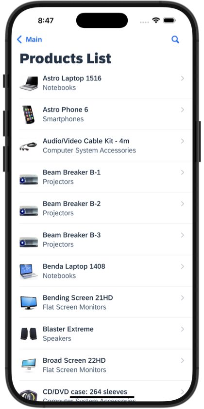
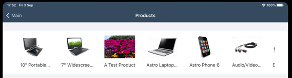
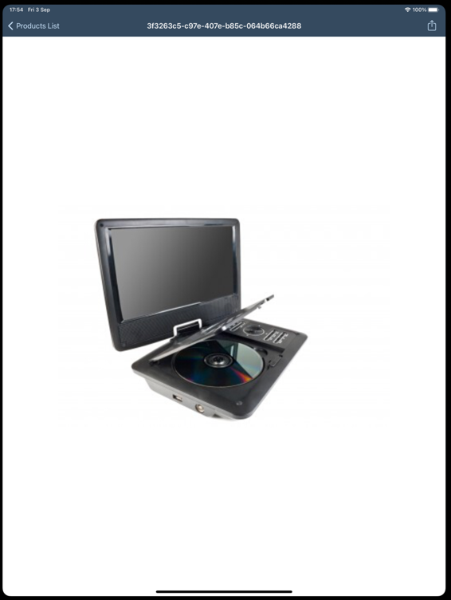
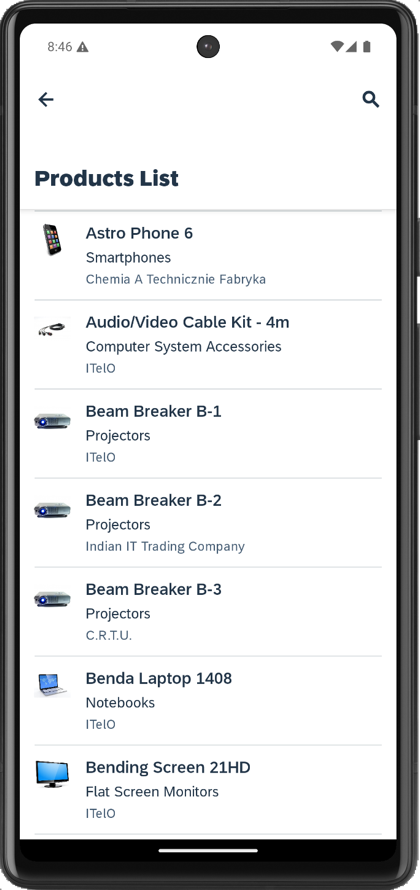
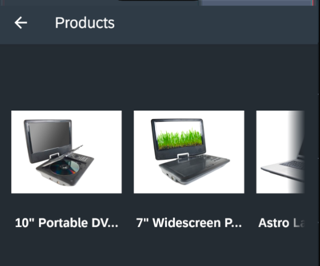
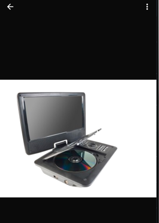

# Image Handling App

This is a showcase application that demonstrate how to:

1. Store media entity to your Offline OData storage
2. Download the media out from your Offline OData storage
3. Write the media to a file
4. Display the media on supported UI controls or display the media using the Open Document action.

*Last Updated: 03-Sep-2021*

***

## Author

* Ming Kho ([GitHub](https://github.com/mingkho), [SAP Community](https://people.sap.com/ming.kho))

***

## Requirements

### *Supported Platforms*

* iOS
* Android

### *MDK Client Version*

* MDK 6.0 or higher

### *Data Source*

* Mobile Services Sample OData ESPM

***

## Key Highlights

* Uses "AutomaticallyRetrievesStreams": true during Offline OData Initialization to pre-download media to the offline storage.
* The demo will download the images from offline storage and write the images a folder and return the path to the images to the respective UI controls or actions.
* Only for the purpose of showcasing, each demo will store the images in different folders.

## Screenshots

### iOS

*Screenshot: iOS Object Table Detail Images*

*Screenshot: iOS Image Collection*

*Screenshot: iOS Image via Open Document*

### Android

*Screenshot: Android Object Table Detail Images*

*Screenshot: Android Image Collection*

*Screenshot: Android Image via Open Document*
