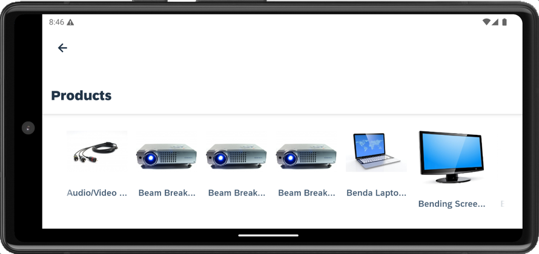
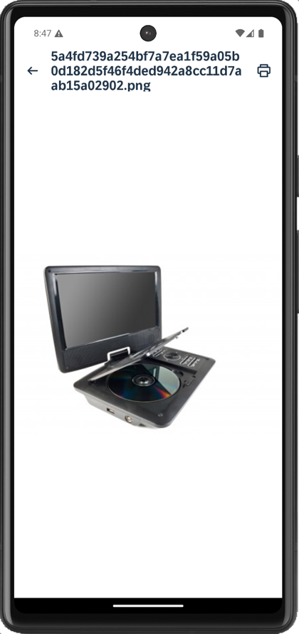

# Image Handling App

This is a showcase application that demonstrate how to:
- Directly bind an OData entity's media stream to easily display OData media images in various UI controls
- Add check to enforce limit of 1 image per Product entity
- Resize the image before uploading steam to the Product entity

*Last Updated: 15-Oct-2025*

***

## Author

* Ming Kho ([GitHub](https://github.com/mingkho), [SAP Community](https://people.sap.com/ming.kho))

***

## Requirements

### *Supported Platforms*

* iOS
* Android

### *MDK Client Version*

* MDK 25.9 or higher

### *Data Source*

* Mobile Services Sample OData ESPM (destination created as com.sap.edm.sampleservice.v4)

***

## Key Highlights

* Uses "AutomaticallyRetrievesStreams": true during Offline OData Initialization to pre-download media to the offline storage.

* The demo will use direct OData media binding on image properties such as `DetailImage`, etc. to easily display OData media images in various UI controls.

## Screenshots

| Functionality | Android | iOS |
| --- | --- | --- |
| Object Table Detail Images |  |  |
| Image Collection |  |  |
| Image via Open Document |  |  |
| Create a Product entity and upload stream to the entity |  |  |

