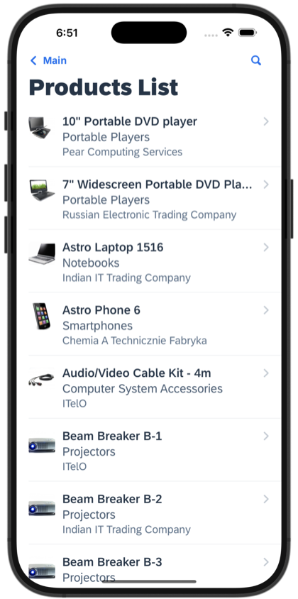
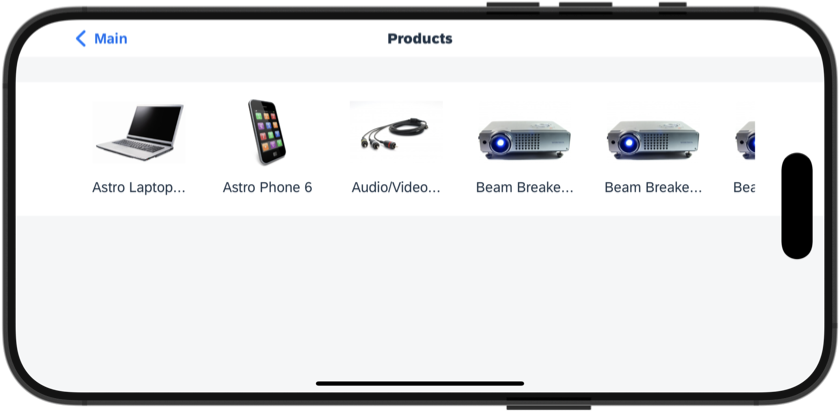
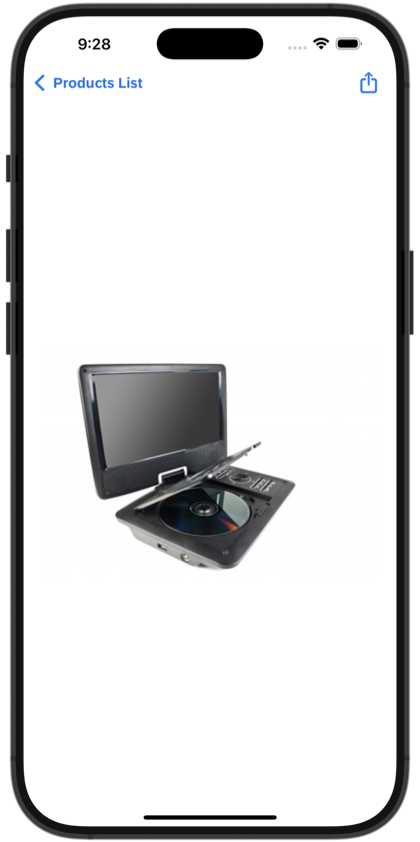

# Image Handling App

This is a showcase application that demonstrate how to:

For MDK 6.1 or newer client:

1. Use direct OData media binding to easily display OData media images in various UI controls

For MDK 6.0 or older client:

1. Store media entity to your Offline OData storage
2. Download the media out from your Offline OData storage
3. Write the media to a file
4. Display the media on supported UI controls or display the media using the Open Document action.

For all version of clients:

1. Create OData media entity using ODataService `CreateMedia` action
   * Note: This will work for both online and offline OData, however, for this sample app it works in offline OData mode only because the Sample OData Service used in this sample app does not allow uploading media.
2. Add check to enforce limit of 1 image per media entity
3. Resize the image before creating the media entity

*Last Updated: 16-Nov-2023*

***

## Author

* Ming Kho ([GitHub](https://github.com/mingkho), [SAP Community](https://people.sap.com/ming.kho))

***

## Requirements

### *Supported Platforms*

* iOS
* Android

### *MDK Client Version*

* MDK 23.8 or higher

### *Data Source*

* Mobile Services Sample OData ESPM

***

## Key Highlights

* Uses "AutomaticallyRetrievesStreams": true during Offline OData Initialization to pre-download media to the offline storage.

For MDK 6.1 or newer client:

* The demo will use direct OData media binding on image properties such as `DetailImage`, etc. to easily display OData media images in various UI controls.

For MDK 6.0 or older client:

* The demo will download the images from offline storage and write the images a folder and return the path to the images to the respective UI controls or actions.
* Only for the purpose of showcasing, each demo will store the images in different folders.

## Screenshots

### iOS

*Screenshot: iOS Object Table Detail Images*

*Screenshot: iOS Image Collection*

*Screenshot: iOS Image via Open Document*

### Android

*Screenshot: Android Object Table Detail Images*

*Screenshot: Android Image Collection*

*Screenshot: Android Image via Open Document*
