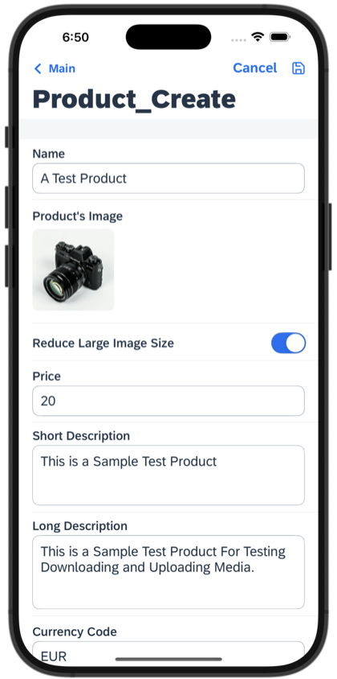

# Image Handling App

This is a showcase application that demonstrate how to:
- Directly bind an OData entity's media stream to easily display OData media images in various UI controls
- Add check to enforce limit of 1 image per Product entity
- Resize the image before uploading steam to the Product entity

*Last Updated: 11-Feb-2025*

***

## Author

* Ming Kho ([GitHub](https://github.com/mingkho), [SAP Community](https://people.sap.com/ming.kho))

***

## Requirements

### *Supported Platforms*

* iOS
* Android

### *MDK Client Version*

* MDK 24.11 or higher

### *Data Source*

* Mobile Services Sample OData ESPM

***

## Key Highlights

* Uses "AutomaticallyRetrievesStreams": true during Offline OData Initialization to pre-download media to the offline storage.

* The demo will use direct OData media binding on image properties such as `DetailImage`, etc. to easily display OData media images in various UI controls.

## Screenshots

### iOS

*Screenshot: iOS Object Table Detail Images*

*Screenshot: iOS Image Collection*

*Screenshot: iOS Image via Open Document*

*Screenshot: Create a Product entity and upload stream to the entity*

### Android

*Screenshot: Android Object Table Detail Images*

*Screenshot: Android Image Collection*

*Screenshot: Android Image via Open Document*

*Screenshot: Create a Product entity and upload stream to the entity*