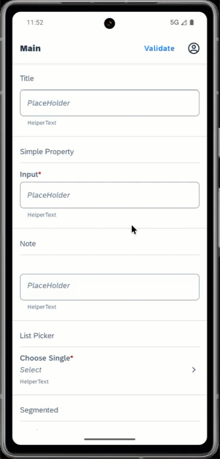

# Inline Validation View App

This is a showcase application that demonstrates how to implement a proper error feedback for [FormCell controls](https://help.sap.com/doc/3642933ef2e1478fb1578ef2acba4ae9/Latest/en-US/reference/schemadoc/index.html#formcell) using inline validation views.

For more details about Inline Errors check out the [SAP Fiori Design Guidelines](https://experience.sap.com/fiori-design-ios/article/inline-errors/)

*Last Updated: 06-Feb-2025*

### Author
* Robin Kuck ([GitHub](https://github.com/robinkuck), [SAP Community](https://community.sap.com/t5/user/viewprofilepage/user-id/16438))

***

## Requirements

### Supported Platforms

* iOS
* Android

### MDK Client Version

* MDK 24.11 or higher

***

## Setup Instructions

No additional steps required. The content of [InlineValidationViewApp/](InlineValidationViewApp/) folder can be used as is to run the application.

## Screenshots

### iOS

 

### Android

 
