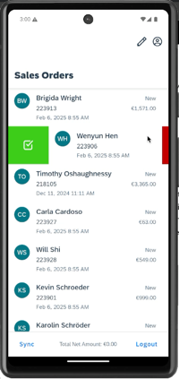
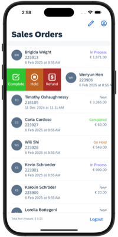

# Multi-Select & Context Menu App

This is a showcase application that demonstrate how to:

1. Use the Selection feature of the Object Table
2. Use the Context Menu feature of the Object Cell in Object Table

*Last Updated: 15-Oct-2025*

***

## Author

* Ming Kho ([GitHub](https://github.com/mingkho), [SAP Community](https://people.sap.com/ming.kho))

***

## Requirements

### *Supported Platforms*

* iOS
* Android

### *MDK Client Version*

* MDK 24.11 or higher

### *Data Source*

* Mobile Services Sample OData ESPM (destination created as com.sap.edm.sampleservice.v4)

***

## Key Highlights

* Using the Selection feature to allow end-user to select multiple sales order items and perform deletion on those items
* Using the Context Menu feature to allow end-user to move each sales order item from one state to another
* Disclaimer: Android only support 1 context menu on each side due the Material Design guideline, while iOS supports multiple items, so, you should design your app accordingly if you are planning to support both multiple platforms. In this sample project we show multiple context menu items on swipe in iOS and only 1 context menu item in Android purely for demonstration purposes only.

## Known Issues

The following list are known issues that we are investigating and will fix in one of the upcoming patch or release:

* In iOS, when you perform an action on an item via the Context Menu, the list will anchor to the modified item, causing the page to jump.
* The Currency formatter API (`formatCurrency`) always return "0" without any currency formatting, when you pass the value 0 to it.

## Screenshots

| Functionality | Android | iOS |
| --- | --- | --- |
| Multi Select |  |  |
| Context Menu |  |  |