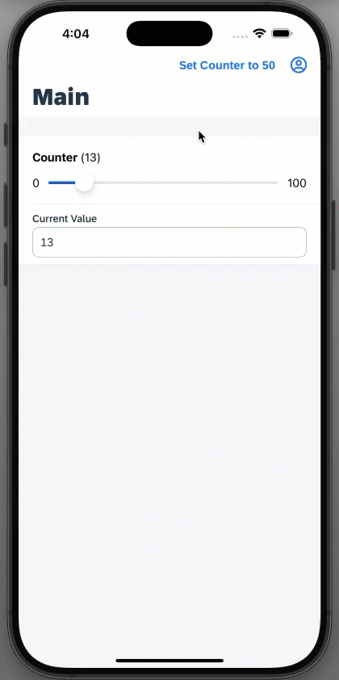
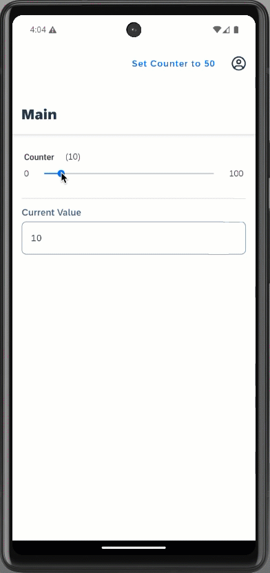

## NativeScript View Extension App

This is a showcase application that demonstrate how to
create and return a NativeScript view in an extension control for Form Cell Extension. You can do this the same way it is already supported for Control Extension by returning a NativeScript view from the `view()` method and return `false` from the `viewIsNative()`.

 You can do similar implementation of creating and returning a NativeScript view in an extension control for Section Extension, Object Cell extension and Object Header Extension types too.

*Last Updated: 16-Sept-2022*

***

## Author

* Jitendra Kansal ([GitHub](https://github.com/jitendrakansal), [SAP Community](https://people.sap.com/jitendrakumar.kansal))

***

## Requirements

### Supported Platforms

* iOS
* Android

### MDK Client Version

* MDK 2208 or higher

***

## Key Highlights

* implements extension using metadata approach to returns NativeScript view from the `view()` method
* consumes the extension control in MDK Form Cell Extension

***

## Setup Instructions

No additional steps required. The content of [NativeScriptViewExtensionApp/](NativeScriptViewExtensionApp/) folder can be used as is to run the application.

## Screenshots

### iOS client

### Android client

