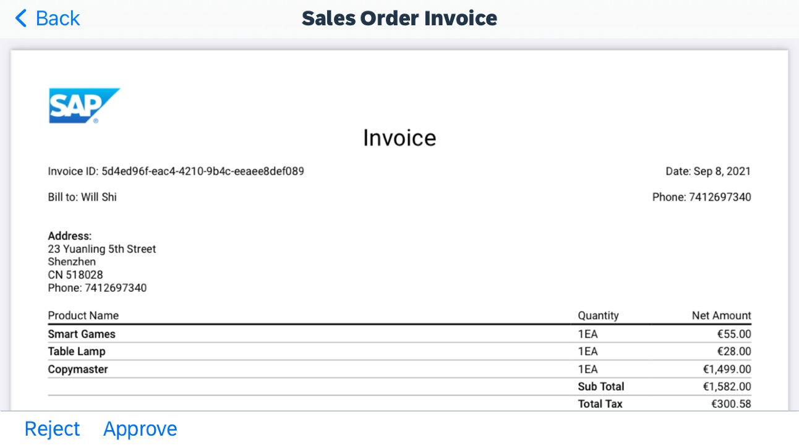
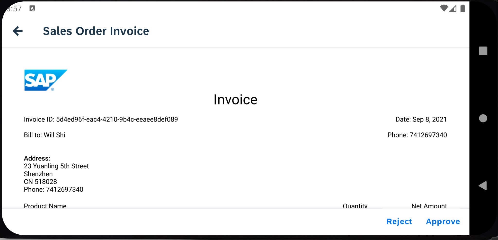

# Read Me First

## PDF Generation App

This is a showcase application that demonstrate how to generate PDF document using 3rd party open source library : [`pdfmake`](https://pdfmake.github.io/docs/0.1/) and also create an MDK Extension that consume 3rd party nativescript plugin [nativescript-pdf-view](https://market.nativescript.org/plugins/nativescript-pdf-view/):

1. Include non-UI based NPM plugin in your custom branded client (`.mdkproject`)
2. Use the plugin in your project to generate PDF document.
3. See [`pdfmake`'s documentation](https://pdfmake.github.io/docs/0.1/document-definition-object/styling/) for more details on customizing the generated PDF.
4. Create an MDK Extension that uses [nativescript-pdf-view](https://market.nativescript.org/plugins/nativescript-pdf-view/) to render PDF directly inside the app. *Note: this approach currently only works for Control Extension (Full Page Extension).*

This showcase application is loosely based on the following guide:
[Pdf generation in NativeScript using JavaScript libraries](https://medium.com/@kumarandena/pdf-generation-in-nativescript-using-javascript-libraries-864ecf4e9a3a)

And contains excerpt of sample code from the following project [`nativescript-pdf-generation`](https://github.com/kumarandena/nativescript-pdf-generation)

*Last Updated: 16-Nov-2023*

***

## Author

* Ming Kho ([GitHub](https://github.com/mingkho), [SAP Community](https://people.sap.com/ming.kho))

***

## Requirements

### Supported Platforms

* iOS
* Android

### MDK Client Version

* MDK 23.8 or higher

### Data Source

* Mobile Services Sample OData ESPM

***

## Key Highlights

* Showing how to import 3rd party NPM plugin into your JavaScript rules.
* Showing how to use the 3rd party NPM plugin in your JavaScript rules to generate PDF file.
* Showing how to create an MDK Extension that uses 3rd party plugin

***

## Setup Instructions

This showcase application requires that you create your own client in order to explore the application.

The `pdfgenapp.mdkproject` folder contains the MDK client configuration to add the external plugins to the client but does not contain the application metadata. The application metadata is the `PDFGeneratorApp` folder and it is assumed that you will load and deploy the metadata to Mobile Services from an MDK Editor.

For a more detailed information on the setup for MDK development please see the following tutorial.

* [Build Your Mobile Development Kit Client Using MDK SDK](https://developers.sap.com/tutorials/cp-mobile-dev-kit-build-client.html)


> Info: For MDK version 6.2 or older, you'd need to make additional changes after executing the create-client:
>
> 1. Generate this project using the the create-client command/cmd
>      * Note: Between MDK version 6.0.3 to 6.2.x, you will get an error when running the create-client command e.g. `TS2307: Cannot find module 'pdfmake/build/pdfmake' or its corresponding type declarations.`. You can ignore this error and continue to the next step to add the `pdfmake` module.
> 2. Go to the generated `PDFGenApp` folder in Terminal
> 3. Execute `npm i pdfmake` to install the PDFMake library to your project (Note: PDFMake is not a NativeScript Plugin, therefore you can't use the `NSPlugins` property in `MDKProject.json` to install it)
> 4. You need to do this every time you regenerate the project using the create-client command/cmd
> 

If you are using SAP Business Application Studio or Visual Studio Code to develop your app, then you need to add `"pdfmake/build/pdfmake"` and `"nativescript-pdf-view"` to the externals property of the built-in MDK bundler tool.

Go to `Preferences` > Search for "MDK Bundler Externals" > Press Edit in settings.son > Add `"pdfmake/build/pdfmake"` and `"nativescript-pdf-view"` inside the `"mdk.bundlerExternals"` array. e.g.

```json
"mdk.bundlerExternals": [
 "pdfmake/build/pdfmake",
 "nativescript-pdf-view"
]
```

`PDFGeneratorApp` is the application metadata project that you can import into your SAP Business Application Studio workspace or SAP Web IDE Full Stack workspace. You should deploy this project to your mobile services account and make sure to enable Mobile Services Sample OData ESPM feature in your mobile services app.

Once the app is running and you have onboarded, do the following steps to generate the PDF file:

1. Press "Sales Orders"
1. Press any one of the sales orders
1. In the detail page of the sales order, you can do one of the following:
   1. Press the Inline PDF Invoice button in the toolbar to generate PDF based on the selected sales order and display it within the app using an MDK Extension
   1. Press the External PDF Invoice button to generate PDF based on the selected sales order and display it using external viewer via the MDK Open Document action.

## Screenshots

### iOS

iOS PDF Screenshot with External Viewer


iOS PDF Screenshot with Inline Viewer (MDK Extension)


### Android

Android PDF Screenshot with External Viewer


Android PDF Screenshot with Inline Viewer (MDK Extension)

