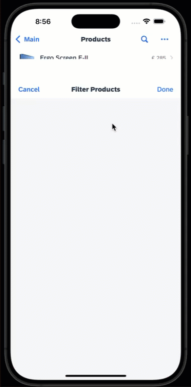
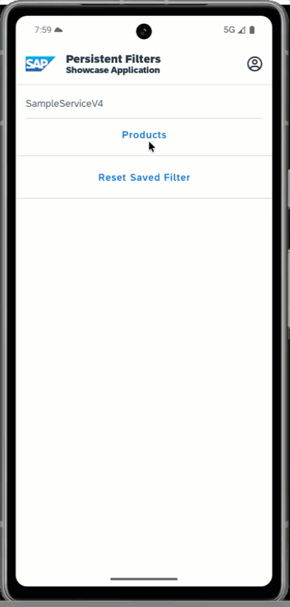
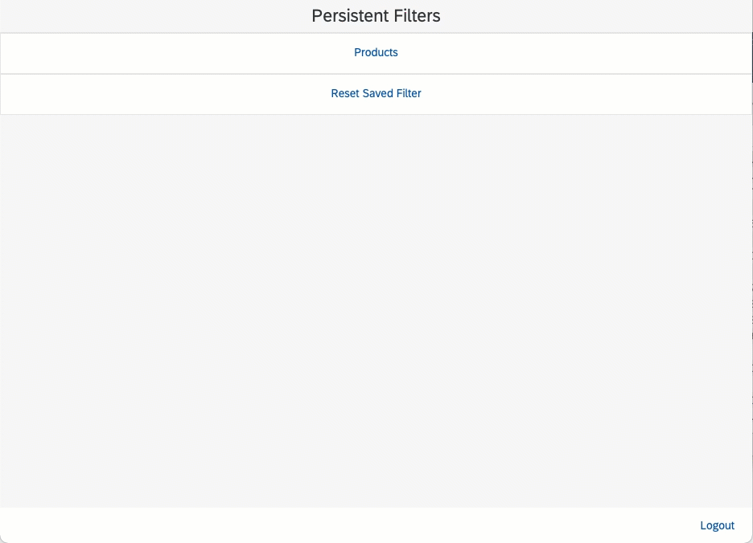

# Persistent Filters App

This is a showcase application that demonstrates how user defined Object Table filter settings can be persisted between opening and closing the list page.  The app includes a Product list page with filter options that are persisted.  The saved filter settings can be cleared using the `Reset Saved Filter` option on the Main page.

The application shows how to:

1. Get the current user applied filter value
2. Save the filters to app settings
3. Reapply the user filter values on opening the list page using the Sectioned Table filters property

*Last Updated: 01-Jul-2023*

***

## Author

* Bill Froelich ([GitHub](https://github.com/billfroelich), [SAP Community](https://people.sap.com/bill.froelich))

***

## Requirements

### *Supported Platforms*

* iOS
* Android
* Web

### *MDK Client Version*

* MDK 6.1 or higher

### *Data Source*

* Mobile Services Sample OData ESPM (destination created as SampleServiceV2)

***

## Key Highlights

* Uses the new Sectioned Table `Filters` metadata property during page loading to set the persisted filter
* Uses the new section table property and client API methods
   * sectionedTable.filters
   * convertFilterCriteriaArrayToJSONString
   * convertJSONStringToFilterCriteriaArray
* Only for the purpose of showcasing how to use the new MDK 6.1 property and associated methods

## Screenshots

### iOS

### Android

### Web

