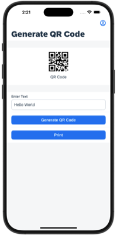
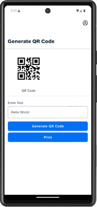

# Print And QR Code App

This is a showcase application that demonstrate how to:

1. Include non-UI based NativeScript plugin in your custom branded client (`.mdkproject`)
2. Use the plugins in your project to:
      1. Generate QR Code as image from text using `nativescript-qr-generator` plugin
      2. Print the image using the `nativescript-printer` plugin

*Last Updated: 15-Aug-2024*

***

## Author

* Ming Kho ([GitHub](https://github.com/mingkho), [SAP Community](https://people.sap.com/ming.kho))

***

## Requirements

### *Supported Platforms*

* iOS
* Android

### *MDK Client Version*

* MDK 24.7 or higher

### *Data Source*

* Mobile Services Sample OData ESPM

***

## Key Highlights

* Showing how to import 3rd party plugin into your rules.
* Make use of ClientData to store information for later use in the app.
* Showing how to execute a rule from another rule.

***

## Setup Instructions

This showcase application requires that you create your own client in order to explore the application.  

The `printapp.mdkproject` folder contains the MDK client configuration to add the external plugins to the client but does not contain the application metadata.  It is assumed that you will load and deploy the metadata to Mobile Services from an MDK Editor.

For a more detailed information on the setup for MDK development please see the following tutorial.

* [Build Your Mobile Development Kit Client Using MDK SDK](https://developers.sap.com/tutorials/cp-mobile-dev-kit-build-client.html)

## Screenshots

### iOS

*Screenshot: iOS QR Code*

*Screenshot: iOS Printing*

### Android

*Screenshot: Android QR Code*

*Screenshot: Android Printing*
