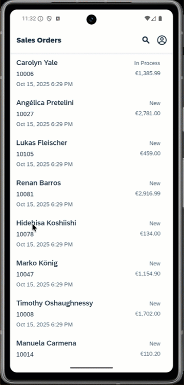

# Sibling Navigation App
Sibling Navigation refers to navigating between elements that are on the same level in a hierarchical app structure, as opposed to navigating between parent and child elements. This type of navigation is useful for allowing users to easily switch between related elements (siblings).

For more details about Sibling Navigation check out the [SAP Fiori Design Guidelines](https://experience.sap.com/fiori-design-ios/article/siblingnavigation/)

*Last Updated: 30-Oct-2025*

### Author
* Robin Kuck ([GitHub](https://github.com/robinkuck), [SAP Community](https://community.sap.com/t5/user/viewprofilepage/user-id/16438))

***

## Requirements

### Supported Platforms

* iOS
* Android

### MDK Client Version

* MDK 25.9 or higher

### Data Source

* Mobile Services Sample OData ESPM (destination created as com.sap.edm.sampleservice.v4)

***

## Key Highlights

* Navigation between MDK Pages with custom modification of [Action Binding](https://help.sap.com/doc/f53c64b93e5140918d676b927a3cd65b/Cloud/en-US/docs-en/guides/getting-started/mdk/development/action-binding-and-result.html#action-binding) (defined in [SiblingNavigationApp/Rules/SalesOrderHeaders_List/OnPressObjectCell.js](SiblingNavigationApp/Rules/SalesOrderHeaders_List/OnPressObjectCell.js), line 8) 

***

## Setup Instructions

The application metadata is the [SiblingNavigationApp](SiblingNavigationApp) folder and it is assumed that you will load and deploy the metadata to Mobile Services from an MDK Editor. Make sure to enable the feature `Sample OData ESPM` (configured with OData Version 4) in your mobile services app.

| Android | iOS |
| --- | --- |
|  |  |