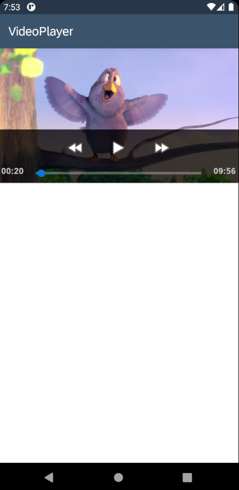
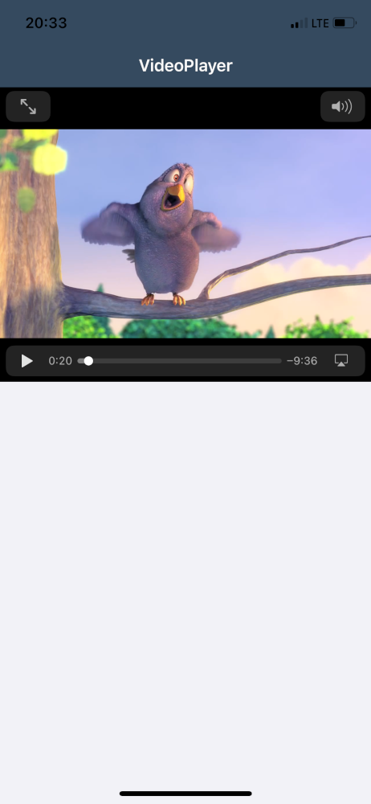

# Read Me First

## Video Player App

This is a showcase application that demonstrate how to play remote videos.

Last Updated: 16-Jun-2021

***

## Requirements

### Supported Platforms

* iOS
* Android

### MDK Client Version

* MDK 5.2 or higher

***

## Key Highlights

* Playing videos from a remote URL.
* Native controls used: [Android VideoView](https://developer.android.com/reference/android/widget/VideoView) and [iOS AVPlayer](https://developer.apple.com/documentation/avfoundation/avplayer)

***

## Setup Instructions

No additional steps required. The content of [metadata/](metadata/) folder can be used as is to run the application.

Screenshots:

Android

iOS

