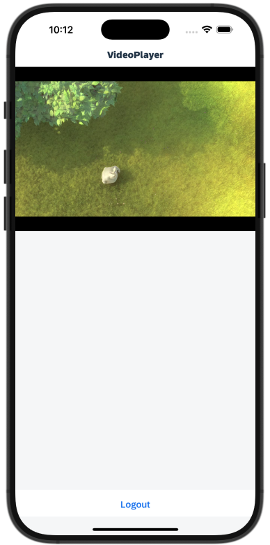

# Video Player View Extension App

This is a showcase application that demonstrates how to implement the Android VideoView and iOS AVPlayer to play remote videos.

* Blog for iOS implementation: [https://blogs.sap.com/2021/04/04/mobile-development-kit-custom-control-videoplayer/](https://blogs.sap.com/2021/04/04/mobile-development-kit-custom-control-videoplayer/)

*Last Updated: 04-Dec-2021*

### Author
* Robin Kuck ([GitHub](https://github.com/robinkuck), [SAP Community](https://people.sap.com/kucki99))

***

## Requirements

### Supported Platforms

* iOS
* Android

### MDK Client Version

* MDK 6.1

***

## Key Highlights

* Playing videos from a remote URL. The remote URL can be bound in the `VideoPlayer.page` to `videoURL` extension property of the extension control.
* Native controls used: [Android VideoView](https://developer.android.com/reference/android/widget/VideoView) and [iOS AVPlayer](https://developer.apple.com/documentation/avfoundation/avplayer)

***

## Setup Instructions

No additional steps required. The content of [metadata/](metadata/) folder can be used as is to run the application.

## Screenshots

 