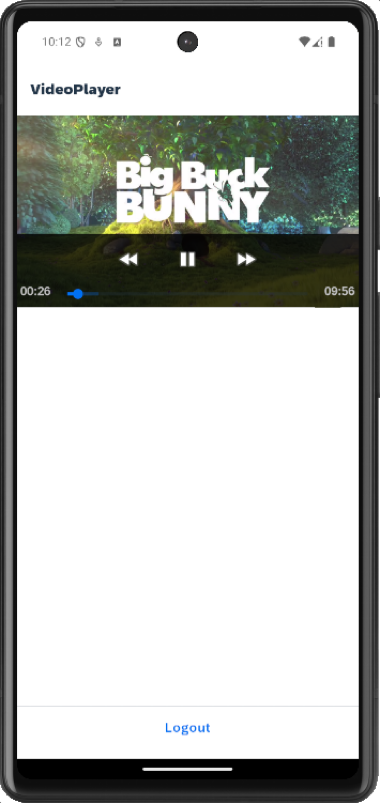

# Video Player View Extension App

This is a showcase application that demonstrates how to implement the Android VideoView and iOS AVPlayer as Extension control to play remote videos.

>iOS implementation part of this application has been referenced from [this](https://blogs.sap.com/2021/04/04/mobile-development-kit-custom-control-videoplayer/) blog post and Android implementation part has been added in addition to it. 

*Last Updated: 21-Oct-2025*

### Author
* Robin Kuck ([GitHub](https://github.com/robinkuck), [SAP Community](https://community.sap.com/t5/user/viewprofilepage/user-id/16438))

***

## Requirements

### Supported Platforms

* iOS
* Android

### MDK Client Version

* MDK 24.11 or higher

***

## Key Highlights

* Playing videos from a remote URL. The remote URL can be bound in the `VideoPlayer.page` to `videoURL` extension property of the extension control.
* Native controls used: [Android VideoView](https://developer.android.com/reference/android/widget/VideoView) and [iOS AVPlayer](https://developer.apple.com/documentation/avfoundation/avplayer)

***

## Setup Instructions

No additional steps required. The content of [VideoPlayerViewExtensionApp/](VideoPlayerViewExtensionApp/) folder can be used as is to run the application.

## Screenshots

| Android | iOS |
| --- | --- |
|  |  |